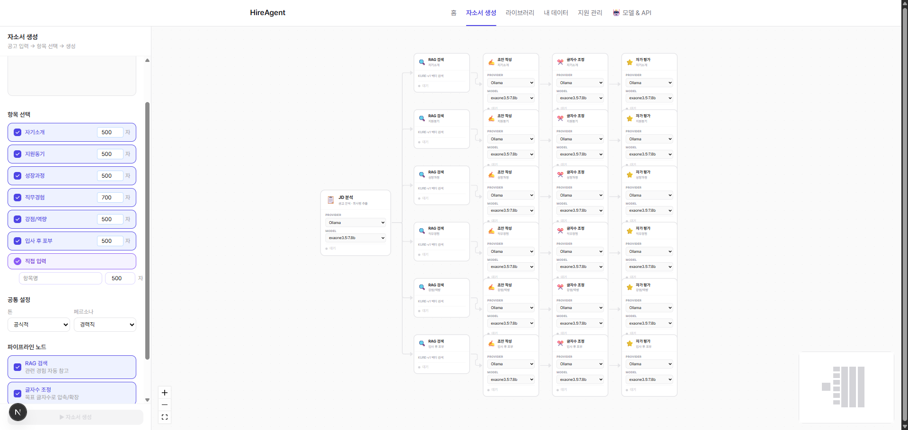
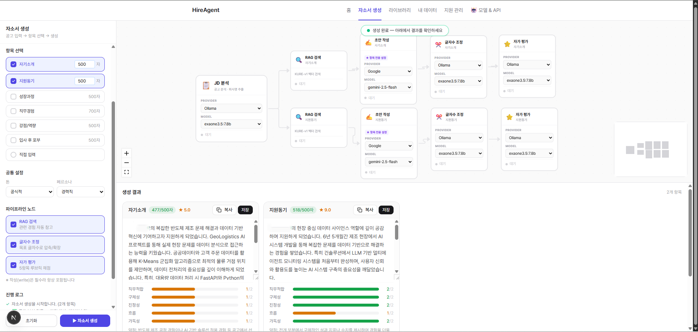
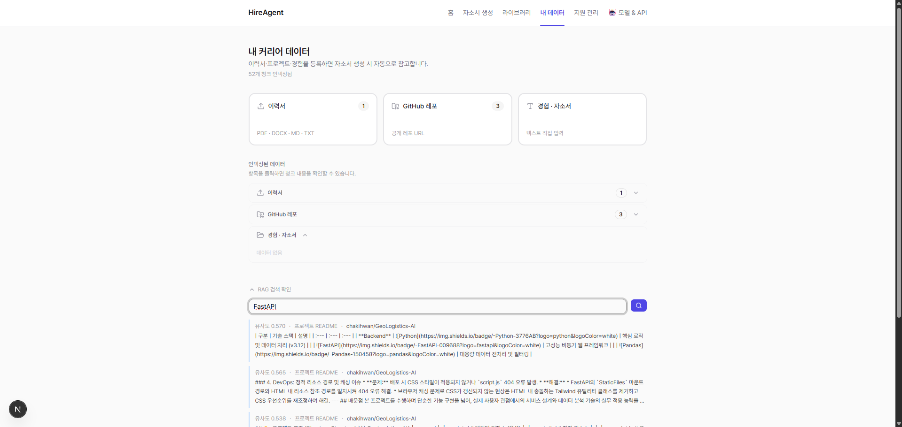
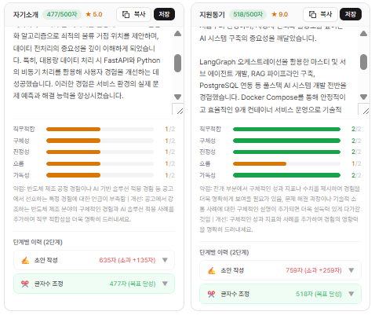
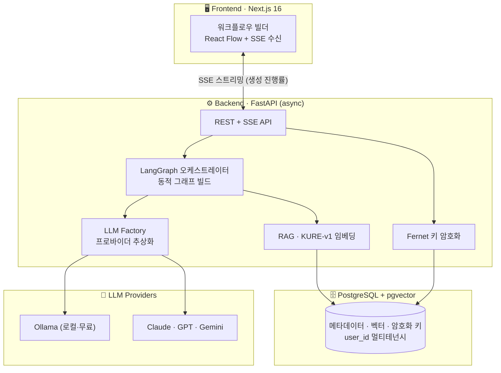
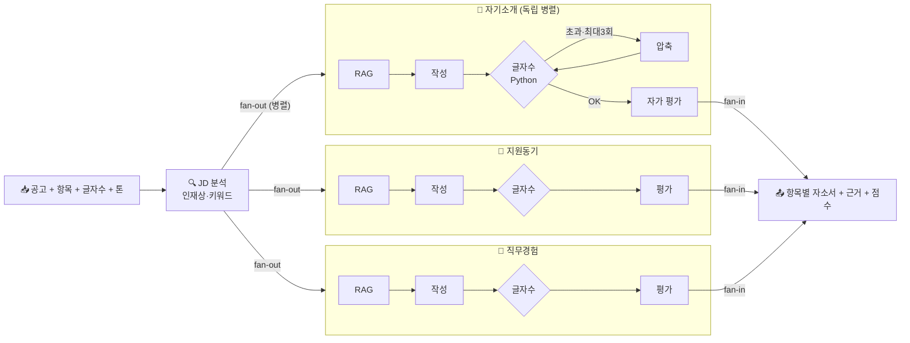
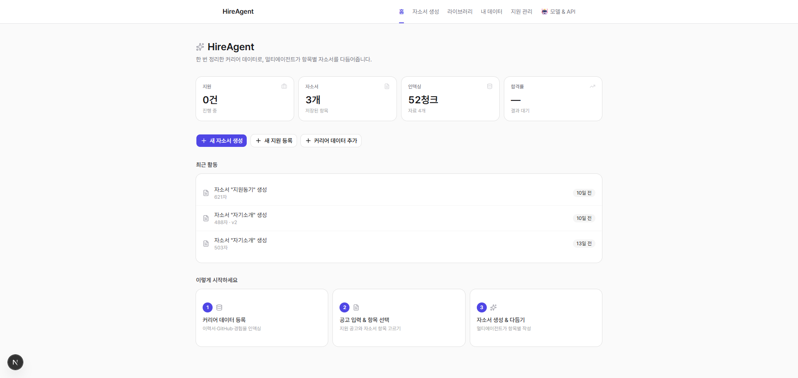
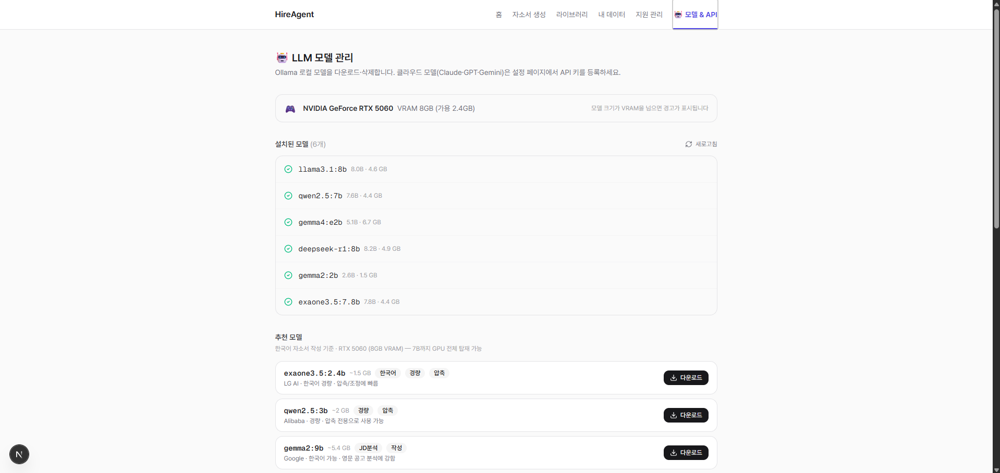

# 🎯 HireAgent

> 한 번 정리한 커리어 데이터로, **항목별 자소서를 멀티에이전트가 토론하며 다듬어주는** AI 도구


<!-- 데모 GIF — 준비되면 교체 (생성 흐름: 공고 입력 → 노드 실시간 색변화 → 결과) -->
<p align="center">
  
</p>

공고를 붙여넣고 항목을 고르면, 여러 AI 에이전트가 **항목마다 병렬로** `RAG 검색 → 작성 → 글자수 조정 → 자가 평가`를 거쳐 자소서를 만들어줍니다. 본인의 이력서·GitHub 경험을 근거로 쓰고, 글자수는 Python으로 정확히 맞추며, 결과를 루브릭으로 채점합니다.

📊 **28개 ADR** · 멀티에이전트 **5단계 파이프라인** · **4개 LLM 프로바이더** · 테스트 **46건**

---

## ✨ 무엇을 하나요

- **항목별 자소서 생성** — 자기소개·지원동기·직무경험 등을 한 번에, 각각 병렬로
- **내 경험 기반 (RAG)** — 이력서·GitHub 레포를 인덱싱해 공고와 맞는 경험을 자동 인용
- **글자수 정확** — LLM이 아니라 Python `len()`으로 ±5% 보장 (한국어 토큰 문제 회피)
- **멀티 LLM** — Ollama(로컬·무료)·Claude·GPT·Gemini를 에이전트별로 선택
- **자가 평가** — 5항목 루브릭 채점 + 생성 단계별 이력 공개

## 🤔 왜 만들었나요

자소서는 **항목마다 글자수·톤이 다르고**, 같은 경험을 회사마다 다시 쓰는 반복 노동입니다. 그렇다고 LLM에 한 번 던지면 **근거 없는 일반론·할루시네이션**이 나오죠. HireAgent는 **커리어 데이터를 한 번만 정리**해두고, **멀티에이전트 파이프라인**이 그 근거로 항목별 초안을 만들고 다듬게 합니다.

> 개인 이직 도구이자, **멀티에이전트 · RAG · 풀스택** 역량을 보여주는 포트폴리오로 만들었습니다.

## 🎬 핵심 기능

### 1. 멀티에이전트 워크플로우 (LangGraph)
공고 분석 후 **항목별로 완전히 독립된 병렬 플로우**가 동시에 실행됩니다. 각 노드(RAG·작성·글자수조정·평가)의 진행 상태가 실시간으로 시각화돼요.



생성이 끝나면 노드가 초록으로 바뀌고, 아래에 **항목별 결과 + 루브릭 점수**가 나옵니다 (에이전트별로 다른 모델 사용 가능 — 아래는 작성·평가에 Gemini, 압축에 로컬 모델):



### 2. RAG — 내 경험을 근거로
이력서(PDF/DOCX)·GitHub 공개 레포를 **KURE-v1 한국어 임베딩 + pgvector**로 인덱싱하고, 공고와 의미적으로 유사한 경험을 자동으로 찾아 자소서 작성에 인용합니다.



### 3. 루브릭 자가 평가 + 투명성
생성된 자소서를 **5항목(직무적합·구체성·진정성·흐름·가독성) 0~2점**으로 채점하고, **초안→압축 단계별 이력**을 공개해 어떻게 다듬어졌는지 보여줍니다.



### 4. 동적 워크플로우 + 멀티 LLM
- **노드 on/off** — RAG·압축·평가를 끄고 켤 수 있는 런타임 동적 그래프 ([ADR-028](docs/adr/028-dynamic-workflow-graph.md))
- **에이전트별 모델** — 분석=Claude, 작성=로컬 exaone 처럼 노드마다 다른 LLM ([ADR-025](docs/adr/025-per-item-agent-config.md))

### 5. 보안 — API 키 암호화
사용자 LLM API 키를 **Fernet(AES-256)으로 암호화해 DB에 저장**하고, 생성 요청 body엔 평문을 싣지 않습니다 ([ADR-027](docs/adr/027-api-key-db-encryption.md)).

## 🧩 기술적 도전과 해결

> 기능보다 **"무엇이 어려웠고 어떻게 풀었는지"** 가 이 프로젝트의 본질입니다.

### 1. LLM은 한국어 글자수를 못 센다
- **문제**: "500자로 써줘"가 안 됨 — LLM은 토큰 단위라 한국어 글자수가 부정확 (자기소개 500자 목표 → 673자 생성).
- **검증**: 로컬 exaone뿐 아니라 **클라우드 Gemini도 동일하게** 수렴 실패함을 실측 ([feedback.md](docs/feedback.md)).
- **해결**: 글자수 검증을 LLM이 아닌 **Python `len()`**으로 ([ADR-001](docs/adr/001-char-count-validation.md)) + 압축 루프(최대 3회) + 인라인 편집. "모델 품질 ≠ 글자수 정확도"를 인정하고 워크어라운드를 설계.

### 2. 병렬 노드의 State 충돌
- **문제**: 항목별 병렬 처리 시 여러 노드가 같은 State 필드에 동시 쓰기 → LangGraph `InvalidUpdateError`.
- **해결**: `Annotated[list, operator.add]` reducer로 병렬 누적 ([ADR-015](docs/adr/015-langgraph-send-item-subgraph.md)).

### 3. 고정 파이프라인 → 동적 그래프
- **문제**: 노드가 코드에 하드코딩돼 사용자가 흐름(RAG·압축 끄기 등)을 바꿀 수 없음.
- **해결**: `NodeSpec`(메타·State 계약) + `WorkflowDef`로 **런타임 그래프 빌드**. **동등성 검증**(기존과 노드·엣지 동일)으로 회귀 없이 리팩터하고, 아키텍처 리뷰를 거쳐 "선형→완전 DAG"까지 로드맵화 ([ADR-028](docs/adr/028-dynamic-workflow-graph.md)).

### 4. 무료 LLM 티어의 rate limit
- **문제**: 멀티에이전트라 호출이 많아 429(quota)·503(과부하)가 빈발, SSE 스트림이 깨짐.
- **해결**: 429/503에 exponential backoff 재시도 + 스트림을 깔끔한 error 이벤트로 종료. 단 **무료 분당 한도는 backoff로 못 푸는 한계**까지 문서에 명시하고 로컬 모델 병행을 권장.

## 🏗️ 아키텍처

### 시스템 구성



**레이어**: `API → Service → Agent(LangGraph) → RAG / LLM Factory`
**설계 원칙**: 모든 DB 쿼리에 `user_id` 필터(멀티테넌시) · LLM은 Factory로 추상화해 **프로바이더 추가 = 한 파일** · 노드는 **런타임 동적 구성**(코드 수정 없이 흐름 변경) · 전 구간 async(asyncpg)

### 생성 파이프라인



- **메인 그래프**: `JD 분석 → Send fan-out(항목별 병렬) → 결과 fan-in`
- **항목 서브그래프**: `build_item_graph(flow)`로 **런타임 동적 구성** (노드 시퀀스 → StateGraph)
- 자세히: [docs/architecture.md](docs/architecture.md)

## 🛠️ 기술 스택

| 영역 | 스택 |
|------|------|
| **백엔드** | FastAPI · LangGraph · PostgreSQL + pgvector · KURE-v1(한국어 임베딩) · SQLAlchemy 2.0(async) |
| **프론트엔드** | Next.js 16 · TypeScript · Tailwind v4 · React Query · React Flow(@xyflow) |
| **LLM** | Ollama(로컬) · Anthropic · OpenAI · Google — Factory 패턴으로 추상화 |
| **인프라** | Docker Compose · (배포 예정: Railway/Fly.io + Vercel) |

## 🚀 빠른 시작

```bash
# 1. 환경변수
cp .env.example .env
# ENCRYPTION_KEY 생성:
python -c "from cryptography.fernet import Fernet; print(Fernet.generate_key().decode())"
# → .env의 ENCRYPTION_KEY에 붙여넣기

# 2. 전체 서비스 실행 (postgres · ollama · backend · frontend)
docker compose up --build

# 3. 접속
# http://localhost:3000
```

> GPU(NVIDIA)가 있으면 `docker-compose.gpu.yml`이 자동 적용돼 Ollama가 GPU를 씁니다. 없으면 CPU로 동작해요.

### ✅ 테스트

```bash
docker compose exec backend pytest   # 46건 — API smoke · RAG 통합 · 그래프 동등성
```

## 🖼️ 더 보기

| 홈 (대시보드) | 모델 관리 |
|:---:|:---:|
|  |  |

## 📐 설계 결정 (ADR)

주요 기술·설계 결정과 근거를 **28개의 ADR**로 기록했습니다 — [docs/adr/](docs/adr/)

대표 결정:
- [ADR-001](docs/adr/001-char-count-validation.md) 글자수는 Python으로 (LLM은 한국어 토큰 부정확)
- [ADR-015](docs/adr/015-langgraph-send-item-subgraph.md) LangGraph `Send` 항목별 병렬 서브그래프
- [ADR-027](docs/adr/027-api-key-db-encryption.md) API 키 DB 암호화
- [ADR-028](docs/adr/028-dynamic-workflow-graph.md) 동적 워크플로우 그래프

## 📄 라이선스

MIT
