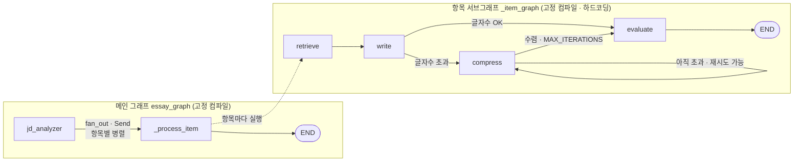
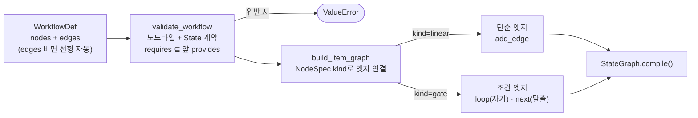
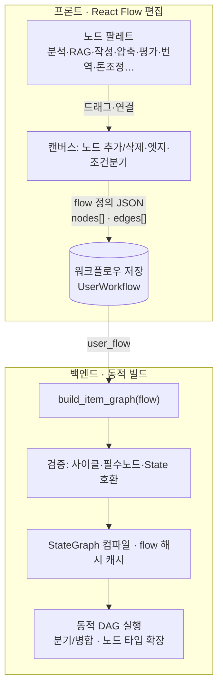

# ADR-028: 동적 워크플로우 그래프 (사용자 정의 노드 편집을 향한)

- **상태**: 채택 (PoC 단계 — 백엔드 동적 빌드 완료, 사용자 편집 UI는 후속)
- **날짜**: 2026-06-09
- **결정자**: 개발자
- **관련**: [ADR-015](015-langgraph-send-item-subgraph.md), [ADR-024](024-react-flow-workflow-builder.md), 요구사항 F-8.4

---

## 컨텍스트

자소서 생성 파이프라인의 노드(분석→RAG→작성→글자수조정→평가)가 **코드에 고정**돼 있다.
사용자는 이 흐름을 직접 편집하고 싶어 한다 — **최종 목표는 노드를 자유롭게 추가/삭제/연결하는
완전 편집(요구사항 F-8.4 "사용자 편집형 노드 그래프")**. ADR-024에서 React Flow UI를 도입했으나
"현재는 시각화 전용"으로 명시했고, 그 편집형으로의 확장이 이 ADR의 대상이다.

한 번에 완전 편집을 구현하기엔 크므로, **백엔드 동적 그래프 빌드를 토대로 깔고 단계적으로** 간다.

---

## 현재 아키텍처 (Before — 고정 그래프)



- 노드/엣지가 `_build_item_graph()`에 **하드코딩**. 변경하려면 코드 수정·재배포.
- 모든 노드는 `ItemState`를 받아 `dict`를 반환하는 **공통 시그니처** (← 동적화의 핵심 단서).
- compress만 특수 — 글자수가 안 맞을 때만 실행되고 수렴(또는 `MAX_ITERATIONS`)까지 반복.

---

## 결정 — 동적 빌드 인프라 (PoC, 이번 단계)

노드를 **메타(NodeSpec) + 그래프 정의(WorkflowDef) → 런타임 빌드 + 계약 검증**으로 전환한다.

```python
@dataclass(frozen=True)
class NodeSpec:                      # 노드 메타
    func: Callable
    kind: str = "linear"            # "linear" | "gate"(조건 루프)
    requires: frozenset[str]         # 의미있게 읽는 State 키
    provides: frozenset[str]         # 의미있게 채우는 State 키
    gate_router: Callable | None

@dataclass
class WorkflowDef:                   # 그래프 정의
    nodes: list[str]
    edges: list[tuple[str, str]]    # 비면 nodes 순서대로 선형 자동 생성

def build_item_graph(workflow: WorkflowDef | list[str]) -> StateGraph: ...
def validate_workflow(wf): ...      # 노드 타입 + State 계약 검증
```

핵심 설계 (아키텍처 리뷰 반영):
- **그래프 자료구조 (WorkflowDef nodes+edges)** — 선형은 그 특수 케이스(edges 자동), 명시
  edges로 DAG도 표현 가능. **단계 4까지 자료구조 전환 없이 연속**된다 (리뷰 #1 해소).
- **gate를 속성으로 (NodeSpec.kind)** — compress 조건 처리가 '위치'(`==compress`)가 아니라
  '속성'(`kind=="gate"`) 기반. 다른 조건 노드(평가 기반 루프 등) 추가가 레지스트리 한 줄 (리뷰 #2 해소).
- **State 계약 (requires/provides)** — "content는 write가 만든다"를 선언 → `evaluate`를 `write`
  앞에 두는 등 무의미한 조합을 빌드 전에 `ValueError`로 거부 (리뷰 #3 해소).
- **동등성 안전장치** — `DEFAULT_ITEM_FLOW` = 기존 고정 그래프 (노드 4·엣지 7 동일, 검증됨).

**빌드 파이프라인:**



이 단계는 **눈에 보이는 기능 변화 없이** 토대만 깐다 — 단 토대가 단계 4(완전 DAG)까지 곧장 이어진다.

---

## 미래 아키텍처 (After — 사용자 정의 워크플로우, 목표 C)



- 사용자가 워크플로우를 **저장/로드/재사용** (UserWorkflow 모델).
- 노드 타입을 **레지스트리에 추가만** 하면 팔레트·빌드에 자동 반영 (확장성).
- compress 같은 조건 노드를 일반화 — 평가 점수 기반 재작성 루프 등 다른 게이트도 표현.

---

## 단계 로드맵

| 단계 | 내용 | 상태 |
|------|------|------|
| 0 | 고정 파이프라인 (`_build_item_graph` 하드코딩) | ✅ 기존 |
| **1 (PoC)** | **동적 빌드 인프라** (`NODE_REGISTRY`+`build_item_graph`, DEFAULT와 동등) | ✅ 이번 |
| 2 (A) | 노드 on/off — flow에서 노드 제외 (RAG·compress 끄기). API + 프론트 토글 | ⬜ |
| 3 (B) | 순서 변경 — flow 순서 편집 (선형 드래그) | ⬜ |
| 4 (C) | 완전 자유 DAG — 노드 추가/삭제/연결 UI + 백엔드 DAG 빌드 + 워크플로우 저장 | ⬜ |

---

## 트레이드오프 / 미해결

| 항목 | 메모 |
|------|------|
| 🔴 **동적 노드 ↔ 정적 State 스키마** | **미해결 (리뷰 #4)** — `ItemState`(TypedDict) 고정. 새 노드 타입이 새 State 키를 요구하면 ItemState 수정·재배포 필요. 즉 확장성이 노드 *함수*엔 있으나 *State*엔 없음. 진짜 플러그인형은 노드별 namespace나 dict 기반 동적 State가 필요 |
| 🟡 **편집 경계 = 항목 서브그래프 한정** | **명시 (리뷰 #5)** — 동적인 건 항목 서브그래프뿐. `jd_analyzer`·`fan_out`(메인)은 고정 → "JD분석 빼기"는 범위 밖. 프론트가 편집 가능 경계를 표시해야 함 |
| 매 요청 컴파일 비용 | flow별 컴파일 결과 캐시 필요 (현재 DEFAULT 1회). 단계 2부터 flow 해시 캐시 |
| DAG 검증 깊이 | 현재 **선형 순서** 기준 State 계약만. 단계 4는 위상정렬 + 사이클·고립 노드 + 계약 통합 |
| gate 라우터는 아직 compress 전용 | kind로 속성화는 됐으나 라우터 구현은 글자수용. 다른 조건(평가 루프)은 라우터 추가 필요 |
| 병렬 분기 | DAG 병렬 분기는 State reducer 충돌 주의 (ADR-015 `operator.add` 패턴 확장) |

---

## 결과

### 긍정적
- ✅ **그래프 자료구조(WorkflowDef)** — 선형→DAG 전환 비용 없이 단계 4까지 연속 (리뷰 #1)
- ✅ **gate 속성화 + State 계약** — 위치 결합 제거 + 무의미 조합(evaluate 먼저 등) 빌드 차단 (리뷰 #2·#3)
- ✅ 기존과 동등 검증 (DEFAULT_ITEM_FLOW, 노드 4·엣지 7) — 회귀 위험 없이 리팩토링
- ✅ 노드 타입 추가가 레지스트리 한 줄 (함수 한정)

### 부정적/후속
- 🔴 동적 노드인데 **State 스키마는 정적** — 새 키 필요 노드는 재배포 (리뷰 #4, 단계 4 전 결정 필요)
- ⚠️ 아직 사용자에게 보이는 변화 없음 (인프라 단계)
- ⚠️ 컴파일 캐시·위상정렬 검증·워크플로우 저장은 단계 2~4로 남음

---

## 변경 이력

| 날짜 | 변경 | 사유 |
|------|------|------|
| 2026-06-09 | 최초 작성 (PoC) | 고정 그래프 → 동적 빌드 토대 + 완전 편집(C) 로드맵 |
| 2026-06-09 | 아키텍처 리뷰 반영 | 그래프 자료구조(#1)·gate 속성화(#2)·State 계약(#3)으로 PoC 보강. State 스키마(#4)·편집 경계(#5)는 미해결로 명시 |
