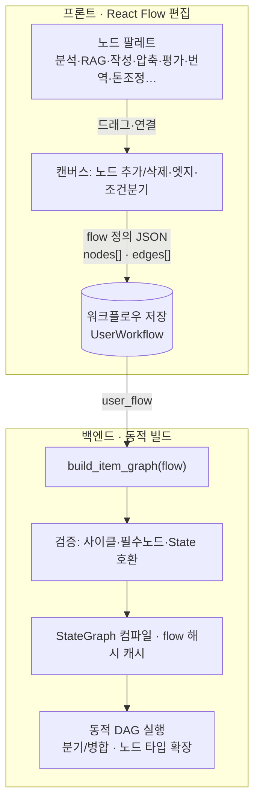

# ADR-028: 동적 워크플로우 그래프 (사용자 정의 노드 편집을 향한)

- **상태**: 채택 (PoC 단계 — 백엔드 동적 빌드 완료, 사용자 편집 UI는 후속)
- **날짜**: 2026-06-09
- **결정자**: 개발자
- **관련**: [ADR-015](015-langgraph-send-item-subgraph.md), [ADR-024](024-react-flow-workflow-builder.md), 요구사항 F-8.4

---

## 컨텍스트

자소서 생성 파이프라인의 노드(분석→RAG→작성→글자수조정→평가)가 **코드에 고정**돼 있다.
사용자는 이 흐름을 직접 편집하고 싶어 한다 — **최종 목표는 노드를 자유롭게 추가/삭제/연결하는
완전 편집(요구사항 F-8.4 "사용자 편집형 노드 그래프")**. ADR-024에서 React Flow UI를 도입했으나
"현재는 시각화 전용"으로 명시했고, 그 편집형으로의 확장이 이 ADR의 대상이다.

한 번에 완전 편집을 구현하기엔 크므로, **백엔드 동적 그래프 빌드를 토대로 깔고 단계적으로** 간다.

---

## 현재 아키텍처 (Before — 고정 그래프)


- 노드/엣지가 `_build_item_graph()`에 **하드코딩**. 변경하려면 코드 수정·재배포.
- 모든 노드는 `ItemState`를 받아 `dict`를 반환하는 **공통 시그니처** (← 동적화의 핵심 단서).
- compress만 특수 — 글자수가 안 맞을 때만 실행되고 수렴(또는 `MAX_ITERATIONS`)까지 반복.

---

## 결정 — 동적 빌드 인프라 (PoC, 이번 단계)

노드를 **레지스트리 + 시퀀스 정의 → 런타임 그래프 빌드**로 전환한다.

```python
NODE_REGISTRY = {"retrieve": ..., "write": ..., "compress": ..., "evaluate": ...}
DEFAULT_ITEM_FLOW = ["retrieve", "write", "compress", "evaluate"]  # 기존과 동등

def build_item_graph(flow: list[str]) -> StateGraph:
    # 선형 시퀀스로 노드를 잇되, compress는 "조건 게이트"로 연결
    ...
```

핵심 설계:
- **공통 시그니처 덕에 타입 시퀀스로 조립** 가능 (ItemState→dict).
- **compress 조건 게이트**: compress로 *진입하는 엣지*와 compress *자기 엣지* 양쪽에 라우터를
  걸어, write 결과가 이미 적정 글자수면 compress를 건너뛴다 (기존 `_needs_compression`과 동일).
- **동등성 안전장치**: `DEFAULT_ITEM_FLOW`로 빌드한 그래프 = 기존 고정 그래프 (노드 4·엣지 7 동일).
- 검증: 잘못된 노드 타입은 `ValueError`. 임의 flow(예: `["write","evaluate"]`)도 빌드됨.

이 단계는 **눈에 보이는 기능 변화 없이** 토대만 깐다 (리팩토링 + 확장점 확보).

---

## 미래 아키텍처 (After — 사용자 정의 워크플로우, 목표 C)



- 사용자가 워크플로우를 **저장/로드/재사용** (UserWorkflow 모델).
- 노드 타입을 **레지스트리에 추가만** 하면 팔레트·빌드에 자동 반영 (확장성).
- compress 같은 조건 노드를 일반화 — 평가 점수 기반 재작성 루프 등 다른 게이트도 표현.

---

## 단계 로드맵

| 단계 | 내용 | 상태 |
|------|------|------|
| 0 | 고정 파이프라인 (`_build_item_graph` 하드코딩) | ✅ 기존 |
| **1 (PoC)** | **동적 빌드 인프라** (`NODE_REGISTRY`+`build_item_graph`, DEFAULT와 동등) | ✅ 이번 |
| 2 (A) | 노드 on/off — flow에서 노드 제외 (RAG·compress 끄기). API + 프론트 토글 | ⬜ |
| 3 (B) | 순서 변경 — flow 순서 편집 (선형 드래그) | ⬜ |
| 4 (C) | 완전 자유 DAG — 노드 추가/삭제/연결 UI + 백엔드 DAG 빌드 + 워크플로우 저장 | ⬜ |

---

## 트레이드오프 / 미해결

| 항목 | 메모 |
|------|------|
| 매 요청 컴파일 비용 | flow별 컴파일 결과를 캐시해야 함 (현재는 DEFAULT 1회 컴파일). 단계 2부터 flow 해시 캐시 |
| DAG 검증 | 사이클·고립 노드·필수 노드(write 등) 누락·State 키 호환을 빌드 시 검사해야 (단계 4) |
| compress 게이트 일반화 | 현재 compress 전용. 단계 4에서 "조건 노드" 추상화 필요 (평가 기반 루프 등) |
| 노드 간 State 의존 | write는 rag_context를 읽음 — RAG 없는 flow면 빈 컨텍스트로 동작(허용). 노드별 입력 요구 명시는 후속 |
| 병렬 분기 | 현재 선형. DAG 병렬 분기는 State reducer 충돌 주의 (ADR-015 `operator.add` 패턴 확장) |

---

## 결과

### 긍정적
- ✅ 노드 시퀀스를 런타임에 구성 — 코드 수정 없이 flow 변경 가능 (토대)
- ✅ 기존과 동등 검증 (DEFAULT_ITEM_FLOW) — 회귀 위험 없이 리팩토링
- ✅ 노드 타입 추가가 레지스트리 한 줄 — 확장성
- ✅ 현재→C 경로가 문서화돼 중간 단계가 버려지지 않음

### 부정적/후속
- ⚠️ 아직 사용자에게 보이는 변화 없음 (인프라 단계)
- ⚠️ 완전 DAG·검증·캐싱·저장은 단계 2~4의 큰 작업으로 남음

---

## 변경 이력

| 날짜 | 변경 | 사유 |
|------|------|------|
| 2026-06-09 | 최초 작성 (PoC) | 고정 그래프 → 동적 빌드 토대 + 완전 편집(C) 로드맵 |
