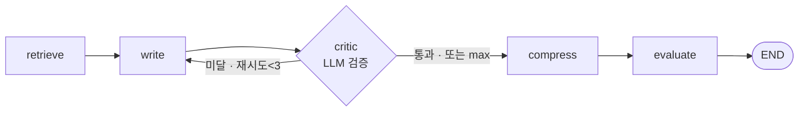
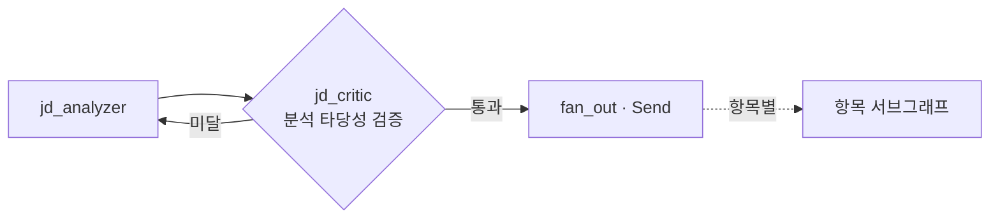

# ADR-029: 노드 자유 구성 — 새 노드 종류·검증 루프·State 확장 (ADR-028 단계 4)

- **상태**: 채택 (4a 구현 — evaluate gate화, 2026-06-16 합의)
- **날짜**: 2026-06-16
- **결정자**: 개발자
- **관련**: [ADR-028](028-dynamic-workflow-graph.md)(동적 빌드 토대), [ADR-015](015-langgraph-send-item-subgraph.md), [ADR-026](026-evaluation-rubric-and-transparency.md)(평가 루브릭), 요구사항 F-8.4

---

## 컨텍스트

ADR-028로 **동적 빌드 토대**(NodeSpec·WorkflowDef·build_item_graph)와 **on/off**(단계 2)까지 왔다.
사용자 요구는 단계 4(완전 DAG)의 구체적 형태다:

> "노드를 자유롭게 생성·커스텀하고 싶다. 예: **JD 분석 결과를 LLM이 검증하고, 맞으면 작성·아니면 재분석**.
> 작성도 마찬가지로 **검증 후 통과하면 다음, 아니면 재작성**."

이는 두 개의 새 능력을 요구하며, **ADR-028이 미해결로 남긴 #4·#5를 정면으로 푼다**:

1. **새 노드 종류**(검증/critic) — 현재 노드는 retrieve·write·compress·evaluate 4종 고정
2. **검증 루프**(판정 실패 → 이전 노드로 되돌아가기) — 현재 gate는 compress **자기 루프**만
3. (#4) critic의 판정 결과·재시도 횟수를 **정적 ItemState 어디에** 둘 것인가
4. (#5) "JD 분석 검증"은 **메인 그래프**(고정) 영역 — 편집 경계를 넓혀야

---

## 현재 구조 (확인된 제약)

```
gate(compress): add_conditional_edges(nid, router, {"loop": nid, "next": after})
                                                            ▲ 자기 자신만
router: 글자수 미달 && iteration < MAX_ITERATIONS(3) → "loop" else "next"

메인 그래프: _build_main_graph() → essay_graph (고정 컴파일)
            jd_analyzer → _fan_out(Send) → _process_item(항목 서브그래프)
            └ 항목 서브그래프만 동적(build_item_graph), 메인은 정적
```

- gate 루프 대상이 **노드 자신으로 하드코딩**(`{"loop": nid}`) → critic→write 역방향 불가
- `ItemState`(TypedDict) **정적** → 새 노드가 새 키를 요구하면 스키마 수정·재배포 (#4)
- 메인 그래프 고정 → JD분석 앞뒤로 노드 못 낌 (#5)

---

## 결정

단계 4를 **4a~4e로 세분**하고, 아래 5개 설계로 간다.

### ① 검증 노드 = gate 일반화 — 루프 대상을 지정 가능하게

> **확정**: 별도 critic 노드 대신 **evaluate를 gate화**(아래 "확정된 결정" #1). 핵심 메커니즘
> (`loop_target`로 역방향 루프)은 동일하며, 아래 critic 예시는 그 일반 패턴 설명용이다.

gate를 "자기 루프"에서 "**지정 노드로 루프**"로 일반화한다. `NodeSpec`에 루프 대상 표현을 추가:

```python
# critic: write 출력을 LLM이 평가(JD부합·구체성) → 통과/재작성 판정
"critic": NodeSpec(
    critic_node, kind="gate",
    requires=frozenset({"content"}),     # write가 만든 content를 검증
    provides=frozenset(),                # content를 새로 만들지 않음(판정만)
    gate_router=_make_critic_router,
    loop_target="write",                 # ← NEW: 미달 시 되돌아갈 노드 (없으면 self=compress식)
),
```

빌드 시:
```python
target = spec.loop_target or nid          # 지정 없으면 자기 루프(compress 호환)
g.add_conditional_edges(nid, spec.gate_router(after), {"loop": target, "next": after})
```

- compress(자기 루프)는 `loop_target=None`으로 **기존과 동일** — 회귀 없음
- critic은 `loop_target="write"` → `write → critic → [통과] next / [미달] write` 루프
- 무한 루프 방지: critic_router도 **max 재시도**(MAX_CRITIC_ITERATIONS) 상한 (compress의 MAX_ITERATIONS 패턴)



### ② State 스키마 #4 — node_io 네임스페이스 채널

새 노드가 새 데이터를 요구할 때 **ItemState를 매번 수정하지 않도록**, 범용 채널 하나를 둔다:

```python
class ItemState(TypedDict):
    ...
    # 노드별 산출물 네임스페이스 — 새 노드 타입이 ItemState 수정 없이 데이터 보관
    node_io: Annotated[dict, _merge_node_io]   # {node_id: {...}}
```

- critic은 판정 결과를 `node_io["critic"] = {"verdict": "fail", "reason": "...", "iteration": n}`에 기록
- **핵심 채널(content·char_count 등)은 그대로** — 공용 계약은 명시 필드 유지, 확장만 dict
- 트레이드오프: `dict[str, Any]`라 타입 안전성↓. 단 #4(정적 스키마)의 현실적 절충 — 노드 함수·State 양쪽 확장성 확보
- 단기 우회: critic만이면 `critic_iteration: int` 필드 하나로도 가능. **node_io는 3번째 새 노드부터 가치** → 4b에서 도입

### ③ 편집 경계 #5 — 메인 그래프도 동적화 (JD 검증용)

JD 분석 검증은 메인 그래프 영역. `_build_main_graph`도 NodeSpec/build 방식으로 전환:



- 메인 그래프는 **fan_out(Send)** 때문에 항목 서브그래프와 구조가 달라 별도 빌더 유지
- 단 노드 추가/검증은 같은 NodeSpec 패턴 재활용
- **우선순위 낮음** — 항목 critic(4a) 검증 후 4e로

### ④ 사이클 안전 — 허용 루프 vs 금지 사이클

자유 연결이 되면 임의 사이클 위험. 빌드 검증에 추가:
- **gate 루프만 허용**(loop_target은 gate 노드의 명시적 되돌이) — 그 외 일반 사이클은 위상정렬로 검출·거부
- 모든 gate는 **max 반복 상한 필수**(NodeSpec에 강제) → 런타임 무한 루프 차단

### ⑤ 워크플로우 저장 — UserWorkflow (4d)

사용자 정의 그래프를 저장/재사용:
```python
class UserWorkflow(Base):
    id; user_id; name
    definition: JSONB          # {nodes: [...], edges: [...]}
    created_at; updated_at
```

---

## 단계 로드맵 (ADR-028 단계 4 세분)

| 단계 | 내용 | 규모 | 사용자 가치 |
|------|------|------|-----------|
| **4a** ✅ | **evaluate gate화 + gate 루프 대상 일반화** (작성 검증→재작성, on/off) | 중 | 품질↑ 즉시 + 새 노드 패턴 확립 |
| 4b | State #4 — node_io 네임스페이스 (임의 노드 데이터) | 중 | 임의 노드 타입 토대 |
| 4c | 프론트 노드 팔레트 — 캔버스에서 노드 추가/삭제 | 큼 | "자유 생성" 가시화 |
| 4d | 자유 연결(엣지 편집) + UserWorkflow 저장/로드 | 큼 | 완전 편집 |
| 4e | 메인 그래프 동적화 (#5) — JD 검증 | 중 | JD 분석 루프 |

**첫 구현 = 4a** — gate 루프 대상 일반화 + critic_node. 기존 gate 인프라를 최대 재활용하고,
"새 노드 종류 추가" 패턴을 검증한다. 4a가 되면 사용자 예시("작성 검증→재작성")가 동작한다.

---

## 트레이드오프 / 미해결

| 항목 | 메모 |
|------|------|
| 🟡 node_io `dict[str, Any]` | 타입 안전성 희생으로 #4 절충. 핵심 채널은 명시 유지, 확장만 dict |
| 🟡 critic = LLM 호출 추가 | 검증마다 LLM 1회 → 비용·지연↑. evaluate(이미 채점)와 **역할 중복** 가능 → critic은 "재작성 트리거", evaluate는 "최종 점수"로 구분하거나 통합 검토 |
| 🟡 메인 그래프 별도 빌더 | fan_out(Send) 구조라 항목 서브그래프 빌더와 통합 불가 → 4e에서 별도 처리 |
| 🔴 LLM 판정 신뢰성 | critic이 "통과/미달"을 LLM으로 판정 → 불안정하면 무한 재작성(max로 차단하나 품질 보장 X) |
| 병렬 분기 reducer | 자유 DAG 분기 시 State 충돌 (ADR-015 operator.add 확장) |
| critic vs evaluate 중복 | 둘 다 품질 평가 LLM. 4a 전 **역할 경계** 결정 필요 (재작성용 critic / 표시용 evaluate) |

---

## 결과 (예상)

### 긍정적
- ✅ gate 루프 대상 일반화 → critic·다른 조건 노드가 레지스트리 등록 + loop_target 한 줄
- ✅ ADR-028 토대(WorkflowDef·NodeSpec) 그대로 단계 4까지 연속 (자료구조 전환 없음)
- ✅ 사용자 예시(작성 검증→재작성)가 4a에서 동작 — 포트폴리오 차별점(자유 구성 멀티에이전트)

### 부정적/후속
- 🔴 node_io 도입 전까지 새 노드는 여전히 ItemState 키 추가 필요 (4b로 해소)
- 🔴 critic/evaluate 역할 중복 — 설계 합의 필요 (아래 결정 대기)
- ⚠️ 4c~4d(프론트 자유 편집·저장)는 큰 작업 — 단계적

---

## 확정된 결정 (2026-06-16 합의)

1. ✅ **evaluate 재활용 (gate화)** — 별도 critic 노드를 만들지 않고 **기존 evaluate를 gate로 전환**.
   루브릭 채점(LLM 1회) 후 점수 미달이면 write로 루프. 판정은 Python(아래 #3) → LLM 중복·역할 충돌 없음.
2. ✅ **첫 구현 = 4a만** — 항목 서브그래프 작성 검증→재작성. JD 검증(4e, 메인 그래프)은 후속.
3. ✅ **루브릭 점수 임계값 (Python 판정)** — `evaluation_scores` 평균 < 임계값이면 재작성.
   Rule #1 정신(판정은 결정론적, LLM은 채점만). 무한 루프는 `MAX_REFINE_ITERATIONS`로 차단.

**4a 설계 확정:**
- evaluate `NodeSpec`을 `kind="gate"` + `loop_target="write"`로 전환 (재작성 활성 시)
- 재작성 on/off는 `enabledNodes`/`flow` 토글 — **기본 off**(기존 동작 유지, 회귀 없음)
- 재시도 카운트 `refine_iteration`(ItemState 단기 필드, node_io는 4b로 미룸)
- `_make_refine_router(after)`: `평균 점수 < THRESHOLD && refine_iteration < MAX → "loop"(write) else "next"`

---

## 변경 이력

| 날짜 | 변경 | 사유 |
|------|------|------|
| 2026-06-16 | 최초 작성 (설계) | ADR-028 단계 4 진입 — 사용자 요구(검증 루프·자유 노드)를 4a~4e로 세분, #4·#5 해소안 제시 |
| 2026-06-16 | 합의 반영 (채택) | evaluate 재활용 gate화·4a만·점수 임계값 Python 판정 확정. 별도 critic 안 만듦(역할 중복 회피), 재작성 기본 off |
