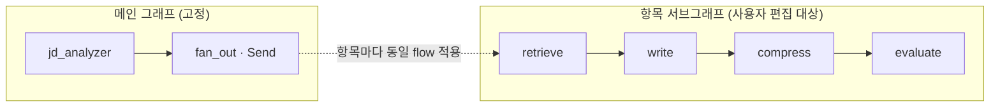

# ADR-030: 비주얼 워크플로우 빌더 — 완전 자유 DAG (ADR-028 단계 4c·4d)

- **상태**: 채택 (4c-1 구현 — 루프 중심·병렬 보류, 2026-06-16 합의)
- **날짜**: 2026-06-16
- **결정자**: 개발자
- **관련**: [ADR-024](024-react-flow-workflow-builder.md)(React Flow 도입), [ADR-028](028-dynamic-workflow-graph.md)(동적 빌드), [ADR-029](029-node-composition-validation-loop.md)(검증 루프·gate 일반화), 요구사항 F-8.4

---

## 컨텍스트

ADR-024에서 React Flow를 "현재 시각화 전용"으로 도입했고, 그 **본래 목적은 사용자가 노드를
블록코딩처럼 자유롭게 추가·삭제·연결하는 비주얼 빌더**다. 지금은 단계 2(on/off)+4a(검증 루프)라
"정해진 노드를 끄고 켜는" 수준 — 사용자 표현으로 "거의 고정"이다.

> "블록을 노드에 연결하고 사용자가 무슨 행위를 할지 정해야 하는 것 아닌가. 누구는 글자수 검증 없이
> JD 분석에 초안만 원할 수도 있다. 추가/삭제만 되고 **연결이 안 되면 테스트를 못 하니 연결까지** 같이."

**결정: 완전 자유 DAG**(임의 분기·병합·루프, Dify급)를 목표로 한다. 백엔드는 ADR-028로 `flow` 기반
동적 빌드가 절반 준비됐고, 병목은 **프론트 캔버스가 편집을 못 하는 것 + 백엔드의 임의 DAG 검증/실행**이다.

---

## 현재 vs 목표

```
[현재]  캔버스 = 자동 레이아웃(읽기 전용). flow는 on/off로 노드 제외만. 선형+gate(자기/역방향 루프).
[목표]  캔버스 = 편집(팔레트·추가·삭제·연결). 임의 DAG(분기/병합/루프) → 백엔드 동적 실행 + 저장.
```

---

## 핵심 설계

### ① 편집 경계 — 항목 서브그래프 우선 (메인은 4e)



- 편집 단위 = **단일 항목 flow 템플릿** (모든 항목에 동일 적용). 항목 간 병렬(fan_out)은 메인 고정.
- 사용자는 "한 항목의 노드 흐름"을 캔버스에서 구성. JD분석 검증(메인 편집)은 #5 → 4e 후속.
- 이유: 항목 간 병렬은 이미 자동(ADR-015), 사용자 관심은 "항목 내부 처리 흐름".

### ② 캔버스 편집 UX

- **모드 전환**: 보기(자동 레이아웃) ↔ 편집(수동 배치)
- **노드 팔레트**: `NODE_REGISTRY` → 노드 종류 목록. 드래그로 캔버스에 추가
- **노드 삭제**: 선택 후 Del / 노드 X 버튼
- **엣지 연결**: 노드 핸들 드래그로 연결, 엣지 클릭 삭제
- **검증 피드백**: 사이클·고립·계약 위반을 실시간 표시(빨강 강조), 생성 버튼 비활성

### ③ flow 직렬화 — 캔버스 ↔ WorkflowDef

```
React Flow {nodes, edges}  ──추출──▶  {nodes: ["retrieve","write",...], edges: [["retrieve","write"],...]}
                           ◀─복원───  WorkflowDef(nodes, edges)  (ADR-028 자료구조 그대로)
```

- ADR-028 `WorkflowDef(nodes, edges)`가 이미 임의 edges를 표현 → **자료구조 전환 없음**
- API: `flow`를 `list[str]`(선형)에서 `{nodes, edges}`(DAG)로 확장 (하위호환: list면 선형)

### ④ 백엔드 임의 DAG — 빌드·검증 확장

`build_item_graph`는 이미 nodes+edges로 빌드. 확장 필요:
- **validate_workflow 확장**:
  - **위상정렬** — 사이클 검출. gate의 명시적 되돌이(loop_target)는 허용 루프, 그 외 사이클은 거부
  - **도달성** — entry에서 모든 노드 도달 + 모든 노드가 END 도달 (고립 거부)
  - **State 계약** — 선형 순서 → **위상순서**로 requires ⊆ 앞 provides 검증
- **무한 루프** — 모든 gate에 max 반복 상한 강제(MAX_ITERATIONS·MAX_REFINE)

### ⑤ State 스키마 #4 — node_io 네임스페이스 (ADR-029 4b 도입)

```python
class ItemState(TypedDict):
    ...
    node_io: Annotated[dict, _merge_node_io]   # {node_id: {...}} — 새 노드가 ItemState 수정 없이 보관
```

- 새 노드 타입(번역·톤조정·검증)이 `node_io[node_id]`에 산출물 보관 → ItemState 재배포 불필요
- 핵심 채널(content 등)은 명시 유지 — 공용 계약

### ⑥ 🔴 병렬 분기 reducer (최대 난제)

DAG 분기(`write → [critic_A, critic_B] → merge`)에서 A·B가 같은 채널(content)을 쓰면 **LangGraph
병합 시 충돌**(InvalidUpdateError). 현재 ItemState 핵심 채널은 last-value.

**해소안 (단계적):**
1. **node_io 격리** — 분기 노드는 자기 출력을 `node_io[node_id]`에만 → 채널 충돌 없음 (병합 노드가 선택)
2. **공용 채널 reducer** — content 등은 "마지막 write 승자" 또는 명시 병합 노드 필요
3. **단계 구현** — 4c는 **단일 경로(체인+루프)**만 허용(분기 금지), 4d에서 분기+reducer 도입

### ⑦ 노드 타입 팔레트 — 레지스트리 확장

`NODE_REGISTRY`에 노드 추가 = 팔레트 자동 반영. 후보: 번역, 톤 조정, 키워드 강조, 사실검증(critic).
단 **새 키 필요 노드는 node_io 도입(⑤) 후**.

### ⑧ 워크플로우 저장 — UserWorkflow

```python
class UserWorkflow(Base):
    id; user_id; name
    definition: JSONB        # {nodes, edges}
    is_default: bool
    created_at; updated_at
```
저장/로드/재사용. 멀티테넌시(user_id 필터, Rule #4).

---

## 단계 구현

| 단계 | 내용 | 핵심 |
|------|------|------|
| **4c-1** | 캔버스 편집 모드 + 팔레트 + 추가/삭제 + 순차 연결 + **🔁 루프 엣지/조건 설정** | flow={nodes,edges} API. 4a gate 일반화 활용 |
| **4c-2** | 백엔드 위상정렬·사이클(허용 루프 구분)·도달성·계약 검증 확장 | validate_workflow 강화 |
| **4d-1** | node_io 네임스페이스 (State #4) + 새 노드 타입 1~2종 | 임의 노드 토대 |
| 🔶 4d-2 | 조건 분기 (if/else 한 갈래) | reducer 충돌 없음 |
| 🔴 ~~4d-3~~ | 병렬 분기 + reducer (난제 ⑥) — **보류** | 자소서 실효성 낮음, 진짜 필요 시 |
| **4d-4** | UserWorkflow 저장/로드 | 재사용 |
| 4e | 메인 그래프 편집 (JD 검증) | #5 |

**첫 구현 = 4c-1** — 캔버스 편집(추가/삭제/순차 연결 + **루프 엣지·조건/횟수 설정**) + flow DAG
직렬화. 루프가 1급 시민 — 사용자가 "몇 번 반복"을 직접 정의한다. 병렬 분기는 보류.

---

## 트레이드오프 / 난제

| 항목 | 메모 |
|------|------|
| 🔴 **병렬 분기 reducer** | 최대 난제. 분기는 4d로 미루고 node_io 격리로 해소 (⑥) |
| 🔴 **사이클 ↔ 루프** | gate loop_target은 허용, 그 외 사이클 거부 — 위상정렬 시 gate 엣지 화이트리스트 |
| 🟡 캔버스 편집 UX | 자동 레이아웃 ↔ 수동 편집 전환. 편집 중 레이아웃 깨짐 주의 |
| 🟡 무한 루프 | 모든 gate max 상한 강제. 사용자가 만든 루프도 상한 |
| 🟡 LLM 비용 | 노드 많을수록 LLM 호출↑ — 사용자 책임이나 경고 표시 검토 |
| 🟡 State 정적성 | node_io(⑤)로 완화하나 `dict[str,Any]` 타입 안전성 희생 |
| 편집 경계 | 항목 서브그래프만(4c·4d). 메인(JD)은 4e |

---

## 결과 (예상)

### 긍정적
- ✅ ADR-028 자료구조(WorkflowDef nodes+edges) 그대로 → 자유 DAG까지 연속
- ✅ 백엔드 절반 준비(build_item_graph) → 4c는 프론트 편집 + 검증 확장이 주
- ✅ 사용자 비전(블록코딩 자유 구성) 실현 — 포트폴리오 최상위 차별점(Dify급 멀티에이전트 빌더)

### 부정적/후속
- 🔴 병렬 분기 reducer는 4d의 핵심 난관 — 단계 격리로 위험 관리
- 🔴 완전 자유 DAG는 여러 단계(4c-1 ~ 4e) — 한 번에 X
- ⚠️ 캔버스 편집 UX는 React Flow 학습 + 검증 피드백 설계 필요

---

## 확정된 전략 (2026-06-16 합의)

> **핵심 재정의**: 자소서 생성은 순서(검색→작성→다듬기→평가)가 본질적으로 **순차**이고,
> 사용자 자유의 본질은 **"이 과정을 몇 번 반복하는가"(루프)**다. 따라서 비주얼 빌더의 가치는
> "병렬 분기"가 아니라 **"순차 파이프라인 + 사용자가 정의하는 루프"**에 있다.

| 우선순위 | 내용 | 비고 |
|----------|------|------|
| ✅ **핵심** | 노드 추가/삭제 + 순차 연결 + **🔁 루프(되돌이 엣지 + 조건 + 최대 횟수)** | 4a gate 메커니즘을 사용자가 직접 구성 |
| 🔶 다음 | 조건 분기 (if/else 한 갈래만 실행) | reducer 충돌 없음 |
| 🔴 **보류** | 병렬 분기 (동시 실행→병합) | 자소서 도메인 실효성 낮음 + reducer 난제. 진짜 필요 시에만 |

**루프 = 이 ADR의 1급 시민.** 4a(evaluate→write 고정 루프)를 일반화 — 사용자가 캔버스에서
되돌이 엣지를 긋고, gate 노드에 **조건(점수 임계값·글자수)·최대 횟수**를 설정한다.

1. ✅ **첫 구현 = 4c-1** (편집 + 순차 연결 + **루프 연결/조건 설정**). 병렬 분기는 보류.
2. ✅ **flow API 확장**: `list[str]`(선형) → `{nodes, edges}`(DAG·루프 포함), 리스트면 선형 하위호환.
3. ✅ **편집 경계**: 항목 서브그래프 우선 (메인 JD는 4e).

---

## 변경 이력

| 날짜 | 변경 | 사유 |
|------|------|------|
| 2026-06-16 | 최초 작성 (상세 설계) | ADR-028 단계 4c·4d — 완전 자유 DAG 비주얼 빌더. 편집 UX·DAG 검증·병렬 reducer·node_io·저장 설계 + 단계 격리 |
| 2026-06-16 | 전략 확정 (채택) | "순차 파이프라인 + 사용자 정의 루프"로 재정의 — 루프 1급 시민, 병렬 분기 보류(자소서 실효성 낮음). 4c-1부터 |
