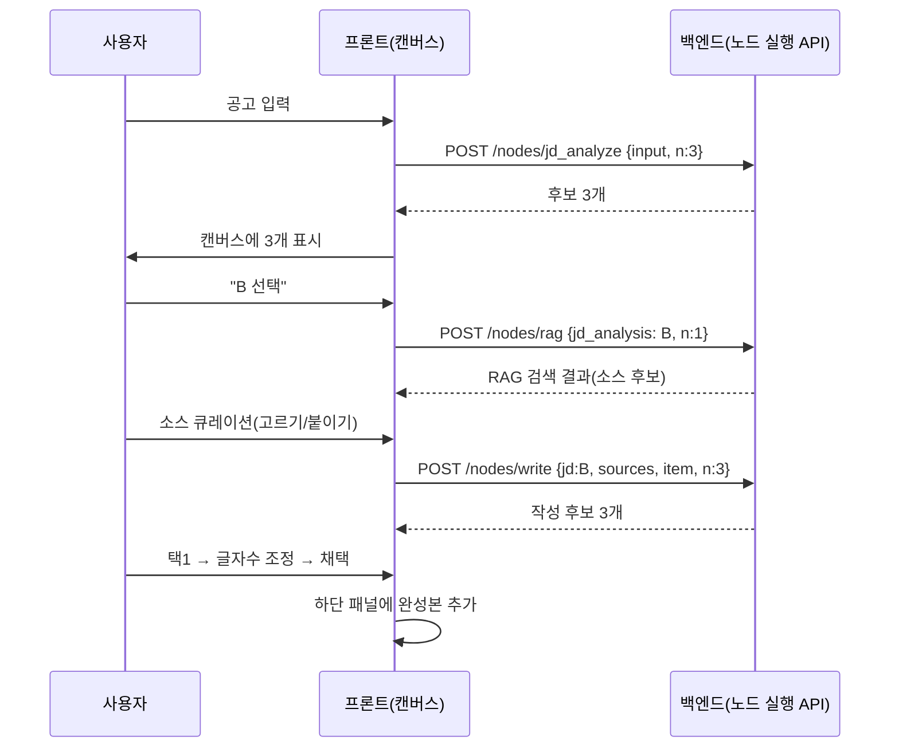
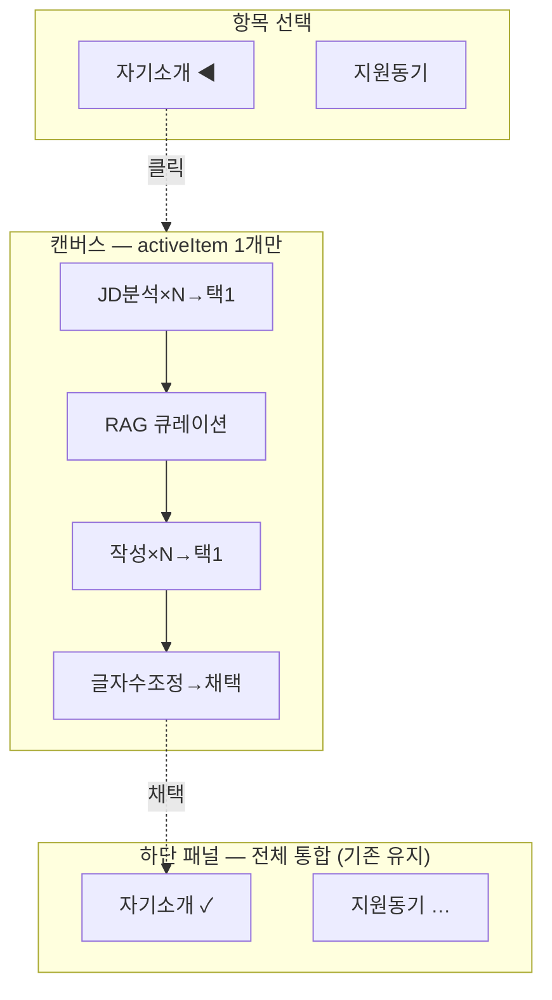

# ADR-031: 대화형 단계 실행 — 노드별 사람 개입 + 후보 큐레이션

- **상태**: 채택 (A+B 구현 — 모델 다양화·두 모드 공존, 2026-06-17 합의)
- **날짜**: 2026-06-17
- **결정자**: 개발자
- **관련**: [ADR-015](015-langgraph-send-item-subgraph.md)(LangGraph 자동 실행), [ADR-024](024-react-flow-workflow-builder.md)(캔버스), [ADR-026](026-evaluation-rubric-and-transparency.md)(투명성), [ADR-028](028-dynamic-workflow-graph.md)·[ADR-029](029-node-composition-validation-loop.md)·[ADR-030](030-visual-workflow-builder-free-dag.md)(동적 그래프), 요구사항 F-8.4

---

## 컨텍스트 — 패러다임 전환

지금 도구는 **"전체 자동 배치 실행"**이다 (ADR-015):

```
공고 입력 → [LangGraph가 JD분석→RAG→작성→압축→평가를 통째로 자동 실행] → 결과 툭
```

중간이 블랙박스고, AI가 알아서 다 한다. 사용자는 결과만 받는다. 사용자가 그리는 비전은
**"각 단계를 사람이 보고·시도하고·고르며 함께 빚는 대화형 작업"**이다:

> "직무 분석을 N번 하고 사용자가 보면서 '이거 잘했네' 고른다. RAG 소스도 직무 분석 바탕으로
> 인용할 문서를 직접 고르거나 (옵시디언처럼) 붙인다 — 없으면 기본값. 항목·글자수를 캔버스에서
> 입력(N번 가능). 작성 결과로 글자수 조정하고, 쓸지 말지 판단한다."

**철학: "AI가 알아서"가 아니라 "AI는 좋은 후보를 만들고, 결정은 사람(큐레이터)이".**
자소서처럼 "내 이야기"가 중요한 영역에선 완전 자동보다 사람 큐레이션이 맞다.

---

## 핵심 통찰 — 노드 = 사람과 협업하는 단위

노드마다 **사람이 개입하는 방식이 다르지만, 골격은 같다**:

```
   노드 실행(N회) → 후보 → [사람 개입] → 선택값 → 다음 노드로 전달
                              ▲ 여기만 노드 종류별로 다름
```

| 노드 | 사람이 하는 일 | 개입 유형 |
|------|--------------|-----------|
| JD 분석 | N개 중 고르기 | **select** (생성→선택) |
| RAG 소스 | 인용 문서 고르기/붙이기 | **curate** (큐레이션) |
| 항목·글자수 | 값 입력 | **input** |
| 작성 | N개 중 고르기 | **select** |
| 글자수 조정 | 채택 여부 | **judge** (판단) |

→ **공통 골격은 하나로, 개입 UI(select/curate/input/judge)만 갈아끼운다.** 이것이 재사용성의 핵심.

---

## 결정

1. **실행 모델 전환** — "전체 자동(LangGraph astream)"에서 **"노드 단위 대화형(프론트 오케스트레이션)"**으로
2. **노드별 개입 패턴 추상화** — 공통 골격(`노드 실행 → 후보 → 개입 → 선택`) + 4종 개입 UI
3. **캔버스(한 항목 집중) ↔ 하단 패널(전체 통합)** 역할 분리
4. **기존 자동 모드는 유지** — "빠른 자동"과 "대화형 정밀"을 둘 다 (마이그레이션 안전)

---

## 핵심 설계

### ① 실행 모델 — 프론트 오케스트레이션



- **백엔드는 그래프를 통째로 안 돌린다.** 노드 함수를 **단독 호출**하는 API만 제공
- **프론트가 지휘자** — 노드 호출 → 사람 개입 → 다음 노드 호출(이전 선택을 input으로)
- 기존 노드 함수(`jd_analyzer_node`·`essay_writer_node`…)는 **그대로 재사용** — State 대신 명시 input
- **N후보 = 모델 다양화** (합의 #3) — 작성 노드는 **N개 모델로 각 1회** 실행 → 모델별 후보.
  `select` 개입에서 모델 비교 후 택1 (예: Claude·GPT·exaone 3개 → 잘 쓴 것 채택)

### ② 노드 단위 실행 API

```
POST /api/v1/nodes/{node_type}/run
  body: { input: {...}, n: int, config: {provider, model} }
  resp: { candidates: [{ output, meta }, ...] }   # n개 (LLM은 temperature로 다양화)
```

- 노드별 input/output 계약은 ADR-028 `requires`/`provides` 재활용
- `jd_analyze`: in `{job_description}` → out `{jd_analysis}`
- `rag`: in `{jd_analysis, selected_sources?}` → out `{rag_context, citations}`
- `write`: in `{jd_analysis, rag_context, category, char_limit, tone, persona}` → out `{content}`
- `compress`: in `{content, char_limit}` → out `{content}`
- `evaluate`: in `{content}` → out `{scores}`

### ③ 노드별 개입 패턴 (공통 골격 + 껍데기)

```typescript
type Interaction =
  | { kind: "select"; candidates: Candidate[] }              // JD분석·작성: N개 택1
  | { kind: "curate"; suggestions: Source[]; allowCustom }   // RAG: 고르기+붙이기
  | { kind: "input"; fields: Field[] }                        // 항목·글자수
  | { kind: "judge"; result: Output };                        // 글자수조정: 채택?
```

- 공통 컴포넌트 `<NodeStep interaction={...} onResolve={selected} />`
- `kind`별 UI만 분기 — 새 노드 추가 시 패턴 재사용 (사용자가 말한 "재사용 가능하게")

### ④ 상태 관리 — 워크플로우 세션

```typescript
type WorkflowSession = {
  items: Record<string, ItemProgress>;   // 항목별 진행
  activeItem: string;                     // 캔버스가 보여주는 항목
};
type ItemProgress = {
  steps: Record<NodeType, { candidates: Candidate[]; selectedIdx: number | null }>;
  finalized: boolean;                     // 글자수조정 채택 완료 → 하단 패널
};
```

- 항목별로 각 노드의 후보·선택을 보관 (안 고른 후보도 남김 → 돌아가기, 4번 답)
- zustand 또는 전용 store

### ⑤ 캔버스 ↔ 하단 패널



- 캔버스 = `activeItem` 하나만 깊게. 항목 전환 = 사이드바 클릭 → 세션에서 그 항목 로드
- 하단 패널 = **기존 그대로** (항목별 카드·루브릭·RAG 인용). 캔버스에서 채택한 게 카드로 채워짐

### ⑥ RAG 소스 큐레이션 (신규)

- RAG 노드가 자동 검색 결과를 **제안**(suggestions) → 사용자가 체크/제외 + **외부 문서 붙여넣기**(옵시디언 노트 등)
- **기본값**: 큐레이션 안 하면 자동 검색 그대로 (현재 동작 — 데이터 없는 사람도 OK)
- "근거를 사람이 고른다" — 자소서 신뢰성의 핵심

---

## 기존 ADR와의 관계

| ADR | 관계 |
|-----|------|
| ADR-015 (LangGraph fan-out 자동) | 대화형은 그래프를 통째로 안 돌림 — **노드 함수만 재사용**, 오케스트레이션은 프론트로. 자동 모드는 유지(공존) |
| ADR-024 (캔버스 시각화) | 캔버스 역할 확장: **시각화 → 작업대**(후보·선택·입력) |
| ADR-028~030 (동적 그래프·자유 DAG) | 그래프 **구조 정의**(노드·순서)는 유효하나 **실행이 자동→대화형**. ADR-030(자유 편집)은 **이 위에서 나중에** — 우선순위는 031 |
| ADR-029 (자동 재작성 루프) | 대화형에선 "자동 재작성" 대신 **사람이 후보 보고 다시 시도** — 4a는 자동 모드용으로 남김 |

> **중요**: ADR-030(자유 DAG 편집)보다 **ADR-031(대화형 큐레이션)이 사용자 실제 우선**.
> 030은 보류, 031에 집중.

---

## 마이그레이션 — 두 모드 공존

```
[빠른 자동]   기존 — 한 번에 전체 생성 (급할 때)
[대화형 정밀] 신규 — 단계별 큐레이션 (제대로 빚을 때)
```

- 기존 `/generate`(자동) 유지 → 안전. 새 대화형은 별도 모드/화면
- 노드 함수·LLM Factory·RAG·DB는 **양쪽 공유** (실행 방식만 다름)

---

## 단계 로드맵

| 단계 | 내용 | 규모 | 가치 |
|------|------|------|------|
| **A** | 노드 단위 실행 API (`/nodes/{type}/run`) — JD분석부터 | 중 | 토대 |
| **B** | 캔버스에 JD분석 N개 후보 표시 + 택1 (개입 `select` 골격) | 중 | 첫 대화형 ⭐ |
| **C** | `<NodeStep>` 공통 골격 + 작성 노드 확장 (select 재사용) | 중 | 재사용 검증 |
| **D** | RAG 큐레이션(curate) + 항목·글자수(input) + 글자수조정(judge) | 큼 | 전 노드 |
| **E** | 워크플로우 세션 상태 + 항목 전환 + 하단 패널 연결 | 큼 | 통합 완성 |

**첫 구현 = A+B** — 노드 단위 API + JD분석 후보 택1. 사용자 핵심("분석 보고 고르기")이
바로 동작하고, 공통 골격(`select`)을 검증해 C~E로 확장.

---

## 난제 / 트레이드오프

| 항목 | 메모 |
|------|------|
| 🔴 **상태 관리 복잡도** | 항목 × 노드 × 후보 × 선택. 세션 store 설계가 핵심 — 안 고른 후보 보관, 돌아가기 |
| 🔴 **두 모드 공존** | 자동(LangGraph)·대화형(프론트 오케스트레이션) 코드 분기. 노드 함수는 공유하되 실행기 둘 |
| 🟡 **N번 = LLM 비용 N배** | N=10이면 호출 10배. 비용·시간 경고 + 기본 N 작게 |
| 🟡 **노드 단독 호출 시 input 구성** | 그래프 State 의존 → 명시 input 계약(ADR-028 provides)으로 정리 |
| 🟡 **RAG 큐레이션 UI** | 검색 제안 + 외부 문서 붙이기. 옵시디언식 연결은 범위 큼 → 텍스트 붙여넣기부터 |
| 🟡 **항목 전환 시 미저장 작업** | 세션에 자동 저장 (작업하던 후보·선택 유지) |
| ADR-030 보류 | 자유 DAG 편집은 031 안정화 후 — 동시 진행 X |

---

## 확정된 결정 (2026-06-17 합의)

1. ✅ **두 모드 공존** — 기존 자동 모드 유지(익숙치 않은 사용자 배려) + 대화형 추가.
2. ✅ **첫 구현 = A+B** — 전체 A~E를 차례로, 첫 묶음은 노드 API + JD분석 후보 택1 (한 번에 X).
3. ✅ **N = 모델 다양화** (핵심 명확화) — "항목·글자수 N번"은 **같은 항목·글자수를 N개의 다른 LLM
   모델로** 각각 작성 → 비교 → 채택. (temperature 다양화 아님!) 예: 자기소개 500자를 Claude·GPT·
   exaone로 각 1개씩 → 3개 후보 → "잘 쓴 모델" 택1. **ADR-025(항목별 모델)의 확장 — 항목당 복수 모델.**
4. ✅ **RAG 큐레이션은 단계 D→후속** — 1차는 텍스트 붙여넣기. **디자인 방향**: 소스를 추가하면
   작은 동그라미(뉴런) 노드가 붙어 "이 근거들로 썼다"가 시각적으로 보이게.

---

## 변경 이력

| 날짜 | 변경 | 사유 |
|------|------|------|
| 2026-06-17 | 최초 작성 (상세 설계) | 자동 배치 → 대화형 단계 실행 전환. 노드별 개입 패턴(select/curate/input/judge)·노드 단위 API·캔버스↔하단 분리·세션 상태·RAG 큐레이션 설계 + A~E 로드맵. ADR-030(자유 DAG)보다 우선 |
| 2026-06-17 | 합의 반영 (채택) | 두 모드 공존·A+B 첫 구현·**N=모델 다양화**(temperature 아님, ADR-025 확장)·RAG 큐레이션 후속+뉴런 디자인 확정 |
