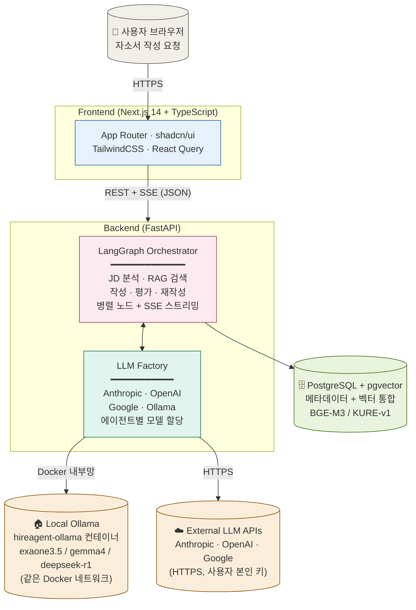
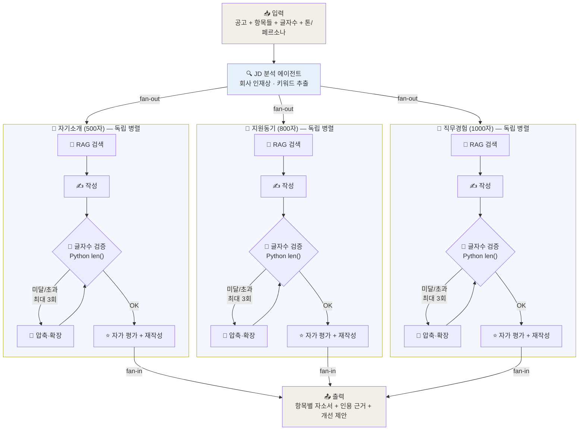
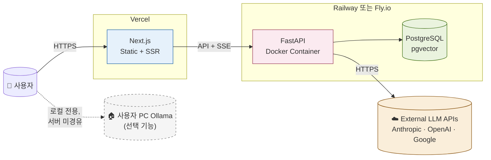

# HireAgent 아키텍처

> **버전**: v0.2
> **작성일**: 2026-05-22
> **연계 문서**: [requirements.md](requirements.md) · 에이전트 상세는 본 문서 §2 "M2 구현 매핑" + [ADR-015](adr/015-langgraph-send-item-subgraph.md)

---

## 1. 시스템 아키텍처

전체 시스템 구성. **로컬 Ollama**와 **외부 LLM API**를 명확히 분리해서 표현한다.



### 핵심 책임 분리

| 컴포넌트 | 책임 |
|---------|------|
| **Frontend (Next.js)** | UI 렌더링, 사용자 입력 수집, REST 호출 + SSE 수신, 클라이언트 상태 관리 |
| **LangGraph Orchestrator** | 에이전트 워크플로우 실행, 병렬 처리, State 관리, 단계별 SSE 이벤트 발행 |
| **LLM Factory** | 멀티 프로바이더 추상화, 모델 선택, **DB에서 암호화 키 조회·복호화 후 메모리 즉시 폐기** |
| **PostgreSQL + pgvector** | 사용자 데이터, RAG 벡터, 자소서 라이브러리, 암호화된 API 키 통합 저장 |
| **Local Ollama (Docker)** | 로컬 LLM 추론 (무료, 오프라인), Docker 내부망으로 백엔드와 연결 |
| **External LLM APIs** | 클라우드 LLM 추론 (Anthropic/OpenAI/Google, 사용자 본인 키로 호출) |

---

## 2. 자소서 생성 파이프라인

자소서 항목별 멀티에이전트 처리 흐름. 핵심 설계 원칙:
- **글자수 검증은 Python으로** (ADR-001)
- **항목마다 완전히 독립된 병렬 플로우**가 동시 실행됨 (LangGraph 병렬 노드)



### 핵심 설계 원칙

1. **항목별 완전 독립 병렬 처리**: 각 항목이 자기만의 RAG/작성/검증/루프를 가짐 (LangGraph fan-out)
2. **글자수 검증 분리**: LLM은 한국어 글자수를 못 셈 → Python `len()` 사용 ([ADR-001](adr/001-char-count-validation.md))
3. **재시도 루프**: 글자수 안 맞으면 압축/확장 에이전트가 조정, **항목별 최대 3회**
4. **자가 평가**: 품질 점검 후 필요시 재작성, 한 번만 수행
5. **단계별 SSE 이벤트**: 각 노드 진입/완료마다 프론트로 진행률 전송 → 사용자가 60초 기다리는 동안 진행 상황 시각화 ([ADR-012](adr/012-sse-streaming-response.md))

### LangGraph State 충돌 회피

병렬 노드가 동시에 같은 State 필드에 쓰면 `InvalidUpdateError` 발생. 회사 프로젝트에서 해결한 패턴 그대로 적용:

```python
from typing import Annotated, TypedDict
from operator import add

class EssayState(TypedDict):
    job_description: str
    items: list[EssayItem]
    drafts: Annotated[list[Draft], add]                       # 병렬 노드가 동시에 추가 가능
    char_counts: Annotated[dict, lambda a, b: {**a, **b}]     # 항목별 카운트 머지
```

### M2 구현 매핑

| 파이프라인 단계 | 파일 | 비고 |
|----------------|------|------|
| State 정의 | `backend/app/agents/state.py` | `EssayState` (메인) / `ItemState` (항목 서브그래프) |
| JD 분석 | `backend/app/agents/jd_analyzer.py` | 인재상/요구역량/직무요약 추출 |
| 항목별 작성 | `backend/app/agents/essay_writer.py` | 톤/페르소나 반영, max_tokens = char_limit × 3 |
| 글자수 검증 | `backend/app/utils/char_counter.py` | `validate_chars()` Python 순수 함수 (ADR-001) |
| 압축/확장 | `backend/app/agents/compressor.py` | `diff_chars()` 기반 방향 결정, 최대 3회 |
| 자가 평가 | `backend/app/agents/evaluator.py` | JSON 출력 (score + suggestion) |
| 오케스트레이션 | `backend/app/agents/orchestrator.py` | LangGraph `Send` API로 fan-out, 항목별 서브그래프 |
| API 엔드포인트 | `backend/app/api/v1/essays.py` | SSE (`/generate`) + 동기 (`/generate/sync`) |

**그래프 구조 (실제 구현):**
- **메인 그래프** (`EssayState`): `jd_analyzer → Send 분기 → _process_item (병렬) → END`
- **항목 서브그래프** (`ItemState`): `write → [validate 분기] → compress(루프) → evaluate → END`
- `Send` API로 각 항목이 독립된 `ItemState`로 fan-out, reducer로 fan-in

---

## 3. 데이터 흐름

### 3.1 사용자가 자소서 작성 요청 시 (SSE 스트리밍)

```
1. [Frontend] 공고 텍스트 + 항목 선택 + 글자수 입력
2. [Frontend] POST /api/v1/essays/generate
              (Accept: text/event-stream)
3. [Backend] 사용자 LLM 설정 조회 (DB에서 암호화 키)
4. [Backend] LLM Factory: 키 복호화 → 클라이언트 생성 → 변수 즉시 폐기
5. [Backend] LangGraph 실행 시작, SSE 응답 시작
6. [Orchestrator] 단계마다 SSE 이벤트 전송:
   ├─ event: "jd_analyzed"        → 인재상/키워드 도출
   ├─ event: "rag_found"           → 항목별 검색 결과 도착
   ├─ event: "draft_done"          → 항목별 초안 완성
   ├─ event: "char_loop"           → 글자수 재시도 (N회차)
   ├─ event: "evaluation_done"     → 자가 평가 점수
   └─ event: "complete"            → 최종 결과 + 라이브러리 저장 ID
7. [Frontend] EventSource로 수신하면서 단계별 UI 업데이트
```

### 3.2 데이터 모델 (ERD)

전체 테이블 구조와 관계는 **[ERD 문서](erd.md)** 참고. M2 시점 4개 테이블:

- `job_applications` ─┐
- `essay_library`     ┘ 1:N FK (ADR-013)
- `career_documents` (RAG, pgvector 1024-dim)
- `user_llm_configs` (Fernet 암호화 API 키)

### 3.3 RAG 데이터 인덱싱 (M4 구현)

```
1. [Frontend] /projects 페이지에서 텍스트 + 메타데이터(source_type, project_name, category, tech_stack) 입력
2. [Backend] POST /api/v1/projects/index
3. [Backend] app/rag/loaders/text.py: RecursiveCharacterTextSplitter로 청킹
              (chunk_size=500, overlap=50, 한국어 구분자 우선)
4. [Backend] app/rag/embeddings.py: KURE-v1 임베딩 생성 (ADR-017)
              (asyncio.to_thread로 이벤트 루프 블로킹 회피)
5. [Backend] career_documents에 user_id + embedding + 메타데이터로 INSERT
6. [Backend] {chunks_created, document_ids} 응답
```

### 3.4 자소서 생성 시 RAG 검색 통합 (M4 구현)

```
ItemState 서브그래프 (orchestrator.py):
  retrieve → write → [validate] → compress(loop≤3) → evaluate → END
     │
     └─ app/agents/rag_retriever.py
        - 쿼리: "{category} 관련 경험. {jd_analysis[:300]}"
        - app/rag/retriever.py: pgvector cosine_distance, user_id 필터
        - threshold 0.8 이하만 채택, 최대 5개
        - state["rag_context"]에 저장

write 노드 (essay_writer.py):
  - 프롬프트에 [참고 경험] 섹션 동적 삽입
  - 시스템 프롬프트: "참고 경험을 자연스럽게 녹여낼 것, 메타 표현 금지"
  - 후처리: 마크다운 헤더/글자수 메타/코드펜스 제거
```

### 3.5 URL 페칭 (M4 구현, ADR-018)

```
1. [Frontend] /generate JD 입력 단계에서 http(s):// 패턴 감지
2. [Frontend] "URL에서 가져오기" 버튼 표시
3. [Backend] POST /api/v1/jobs/fetch-url
4. [Backend] httpx GET + BeautifulSoup 본문 추출
              script/style/nav/header/footer 제거, main/article 우선
5. [Backend] 차단(403)/로그인 필요(401)/JS 렌더링 등 케이스별 사용자 친화 에러
6. [Frontend] textarea를 추출 텍스트로 교체, 사용자가 검토/수정
```

---

## 4. 보안 아키텍처

### 4.1 API 키 흐름

```
[Frontend] 사용자가 설정 페이지에서 Claude API 키 입력
    ↓ HTTPS (TLS)
[Backend] 키 수신 (POST /api/v1/settings/llm-keys)
    ↓
[Backend] utils/crypto.py: encrypt_api_key()  ← Fernet AES-256
    ↓
[PostgreSQL] user_llm_configs.encrypted_keys (JSONB) 저장

사용 시:
[LangGraph] LLM Factory가 키 필요
    ↓
[Backend] DB에서 암호화 토큰 조회
    ↓
[Backend] utils/crypto.py: decrypt_api_key() → 변수에 평문
    ↓
[LLM Factory] LLMProvider 인스턴스 생성 (생성자에 키 전달)
    ↓
[Backend] 호출 직후 `del api_key` 로 메모리에서 평문 제거
    ↓ HTTPS
[External LLM API] 호출
```

**주의 — 개발용 임시 엔드포인트**:
M1의 `POST /api/v1/llm/test`는 request body에 API 키를 평문으로 받는다. 이는 **개발/디버깅 전용**이며 M3 설정 페이지 구현 후 제거된다. 운영에서는 반드시 위의 암호화 플로우를 따른다.

### 4.2 멀티테넌시

모든 DB 쿼리에 `user_id` 필터 강제. pgvector 검색에서도 메타데이터 필터로 user_id 일치 보장.

```python
# ✅ 항상 이런 패턴
async def get_user_documents(user_id: str, query_vector: list[float]):
    return await db.execute(
        select(CareerDocument)
        .where(CareerDocument.user_id == user_id)  # 필수!
        .order_by(CareerDocument.embedding.cosine_distance(query_vector))
        .limit(10)
    )
```

---

## 5. 배포 아키텍처 (Phase 3)



**Ollama는 Phase 3에서 "선택 기능"으로 제공한다**:
- 서버에 Ollama를 올리지 않음 (GPU 비용 문제)
- 사용자 PC에 Ollama가 설치되어 있는 경우에만 활성화
- 브라우저 → 로컬 Ollama 직접 호출 (서버 미경유, CORS 해결책 필요)
- 자세한 정책은 [ADR-014](adr/014-phase3-ollama-local-only.md)

---

## 6. 기술 선택 근거 요약

상세는 [ADR 폴더](adr/) 참고.

| 결정 | ADR | 한 줄 요약 |
|------|-----|-----------|
| 글자수는 Python `len()` | [001](adr/001-char-count-validation.md) | LLM은 한국어 글자수 못 셈 |
| 자동 입력 미지원 | [002](adr/002-no-auto-job-submit.md) | IP 밴, 보안, 유지보수 부담 |
| 멀티유저 처음부터 | [003](adr/003-multi-user-design-from-start.md) | Phase 3 재설계 비용 회피 |
| pgvector 채택 | [004](adr/004-pgvector-over-chroma.md) | DB 통합 운영 |
| BGE-M3/KURE-v1 | [005](adr/005-korean-embeddings.md) | 한국어 도메인 |
| LangGraph | [006](adr/006-langgraph-orchestration.md) | 회사 프로젝트 경험 활용 |
| Next.js 처음부터 | [007](adr/007-nextjs-from-start.md) | 채용 시장, Claude Code 친화 |
| 멀티 LLM 프로바이더 | [008](adr/008-multi-llm-provider.md) | 사용자 비용 컨트롤 |
| 텍스트 입력 우선 | [009](adr/009-jd-input-text-first.md) | IP 밴 방지 |
| 전용 Ollama 컨테이너 | [010](adr/010-dedicated-ollama-container.md) | 다른 프로젝트와 분리, docker-compose 통합 관리 |
| LLM Factory 레지스트리 | [011](adr/011-llm-factory-registry-pattern.md) | 새 프로바이더 추가 시 한 줄 등록 |
| SSE 스트리밍 응답 | [012](adr/012-sse-streaming-response.md) | 60초+ 처리 시간, 단계별 진행률 표시 |
| JobApplication 모델 | [013](adr/013-job-application-model.md) | 자소서-공고-합격이력 연결 |
| Phase 3 Ollama 로컬 전용 | [014](adr/014-phase3-ollama-local-only.md) | 서버 GPU 비용 회피 |

---

## 변경 이력

| 버전 | 날짜 | 변경 |
|------|------|------|
| v0.1 | 2026-05-22 | 초기 작성 (M1 시작 시점) |
| v0.2 | 2026-05-22 | 아키텍처 검토 반영: 파이프라인 병렬 흐름 명확화, Ollama 위치 분리, SSE 스트리밍 추가, ADR 010~014 반영, LLM 테스트 엔드포인트 보안 경고 |
