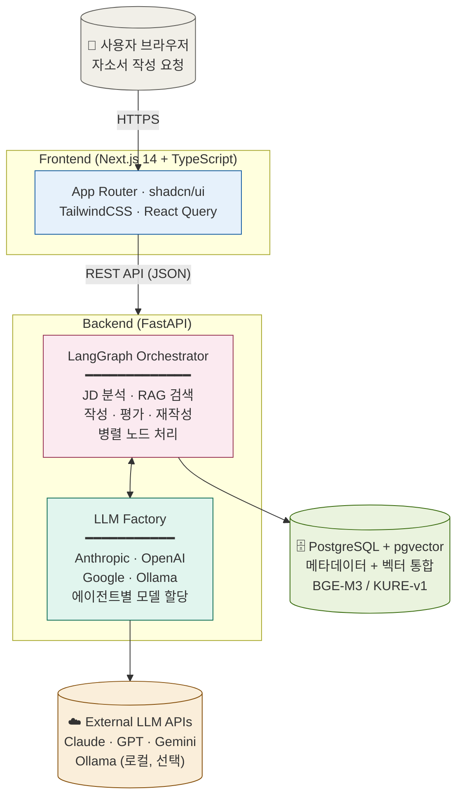
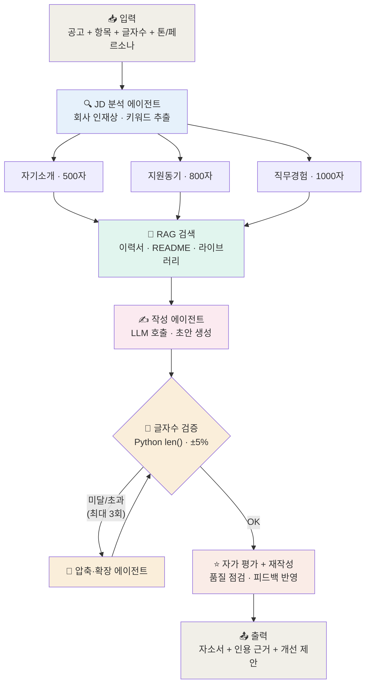
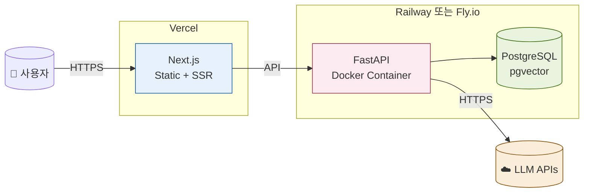

# HireAgent 아키텍처

> **버전**: v0.1
> **작성일**: 2026-05-22
> **연계 문서**: [requirements.md](requirements.md), [agents.md](agents.md) (작성 예정)

---

## 1. 시스템 아키텍처

전체 시스템 구성. 사용자 브라우저 → Next.js 프론트 → FastAPI 백엔드 → 외부 의존성(DB, LLM).



### 핵심 책임 분리

| 컴포넌트 | 책임 |
|---------|------|
| **Frontend (Next.js)** | UI 렌더링, 사용자 입력 수집, API 호출, 클라이언트 상태 관리 |
| **LangGraph Orchestrator** | 에이전트 워크플로우 실행, 병렬 처리, State 관리 |
| **LLM Factory** | 멀티 프로바이더 추상화, 모델 선택, API 키 복호화 |
| **PostgreSQL + pgvector** | 사용자 데이터, RAG 벡터, 자소서 라이브러리 통합 저장 |
| **External LLM APIs** | 실제 LLM 추론 (사용자 본인 키로 호출) |

---

## 2. 자소서 생성 파이프라인

자소서 항목별 멀티에이전트 처리 흐름. 핵심: **글자수 검증은 Python으로 (LLM 미사용)**.



### 핵심 설계 원칙

1. **항목별 병렬 처리**: LangGraph의 병렬 노드로 자기소개/지원동기/직무경험 동시 생성
2. **글자수 검증 분리**: LLM은 글자수 못 세니까 Python `len()` 사용 → [ADR-001](adr/001-char-count-validation.md)
3. **재시도 루프**: 글자수 안 맞으면 압축/확장 에이전트가 조정, 최대 3회
4. **자가 평가**: 품질 점검 후 필요시 재작성

### LangGraph State 충돌 회피

병렬 노드가 동시에 같은 State 필드에 쓰면 `InvalidUpdateError` 발생. 회사 프로젝트에서 해결한 패턴 그대로 적용:

```python
from typing import Annotated, TypedDict
from operator import add

class EssayState(TypedDict):
    job_description: str
    items: list[EssayItem]
    drafts: Annotated[list[Draft], add]  # 병렬 노드가 동시에 추가 가능
    char_counts: Annotated[dict, lambda a, b: {**a, **b}]
```

---

## 3. 데이터 흐름

### 3.1 사용자가 자소서 작성 요청 시

```
1. [Frontend] 공고 텍스트 + 항목 선택 + 글자수 입력
2. [Frontend] POST /api/v1/essays/generate
3. [Backend] 사용자 LLM 설정 조회 (DB에서 암호화 키 복호화)
4. [Backend] LangGraph 실행 시작
5. [Orchestrator] JD 분석 에이전트 호출 (LLM Factory → Claude/GPT)
6. [Orchestrator] 항목별 병렬 노드 시작
   ├─ RAG 검색 (pgvector 코사인 유사도)
   ├─ 작성 에이전트 (LLM 호출)
   ├─ 글자수 검증 (Python)
   └─ (필요시) 압축/확장 루프
7. [Orchestrator] 자가 평가 + 재작성
8. [Backend] 결과를 자소서 라이브러리에 저장 (옵션)
9. [Backend] Frontend로 응답
10. [Frontend] 결과 표시 + 사용자 검토
```

### 3.2 RAG 데이터 인덱싱 시

```
1. [Frontend] 이력서 PDF 업로드 또는 GitHub URL 입력
2. [Backend] POST /api/v1/projects/index
3. [Backend] 데이터 로더로 파싱 (PDF/MD/GitHub README)
4. [Backend] 청킹 (의미 단위로 분할)
5. [Backend] BGE-M3 임베딩 생성
6. [Backend] 메타데이터 추출 (프로젝트명, 기술스택, 카테고리)
7. [Backend] pgvector에 INSERT (user_id 포함)
8. [Backend] Frontend로 인덱싱 결과 응답
```

---

## 4. 보안 아키텍처

### 4.1 API 키 흐름

```
[Frontend] 사용자가 설정 페이지에서 Claude API 키 입력
    ↓ HTTPS (TLS)
[Backend] 키 수신
    ↓
[Backend] AES-256 (Fernet) 암호화
    ↓
[PostgreSQL] user_llm_configs 테이블에 암호화된 채로 저장
    
사용 시:
[LangGraph] LLM Factory가 키 필요
    ↓
[Backend] DB에서 암호화 키 조회
    ↓
[Backend] 메모리에서 복호화
    ↓
[LLM Factory] LLM 클라이언트 생성
    ↓ HTTPS
[External LLM API] 호출
    ↓
[Backend] 응답 받은 후 메모리에서 즉시 키 제거
```

### 4.2 멀티테넌시

모든 DB 쿼리에 `user_id` 필터 강제. pgvector 검색에서도 메타데이터 필터로 user_id 일치 보장.

```python
# ✅ 항상 이런 패턴
async def get_user_documents(user_id: str, query_vector: list[float]):
    return await db.execute(
        select(CareerDocument)
        .where(CareerDocument.user_id == user_id)  # 필수!
        .order_by(CareerDocument.embedding.cosine_distance(query_vector))
        .limit(10)
    )
```

---

## 5. 배포 아키텍처 (Phase 3)



---

## 6. 기술 선택 근거 요약

상세는 [ADR 폴더](adr/) 참고.

| 결정 | ADR | 한 줄 요약 |
|------|-----|-----------|
| 글자수는 Python `len()` | [001](adr/001-char-count-validation.md) | LLM은 한국어 글자수 못 셈 |
| 자동 입력 미지원 | 002 | IP 밴, 보안, 유지보수 부담 |
| 멀티유저 처음부터 | 003 | Phase 3 재설계 비용 회피 |
| pgvector 채택 | 004 | DB 통합 운영 |
| BGE-M3/KURE-v1 | 005 | 한국어 도메인 |
| LangGraph | 006 | 회사 프로젝트 경험 활용 |
| Next.js 처음부터 | 007 | 채용 시장, Claude Code 친화 |
| 멀티 LLM 프로바이더 | 008 | 사용자 비용 컨트롤 |
| 텍스트 입력 우선 | 009 | IP 밴 방지 |

---

## 변경 이력

| 버전 | 날짜 | 변경 |
|------|------|------|
| v0.1 | 2026-05-22 | 초기 작성 (M1 시작 시점) |
