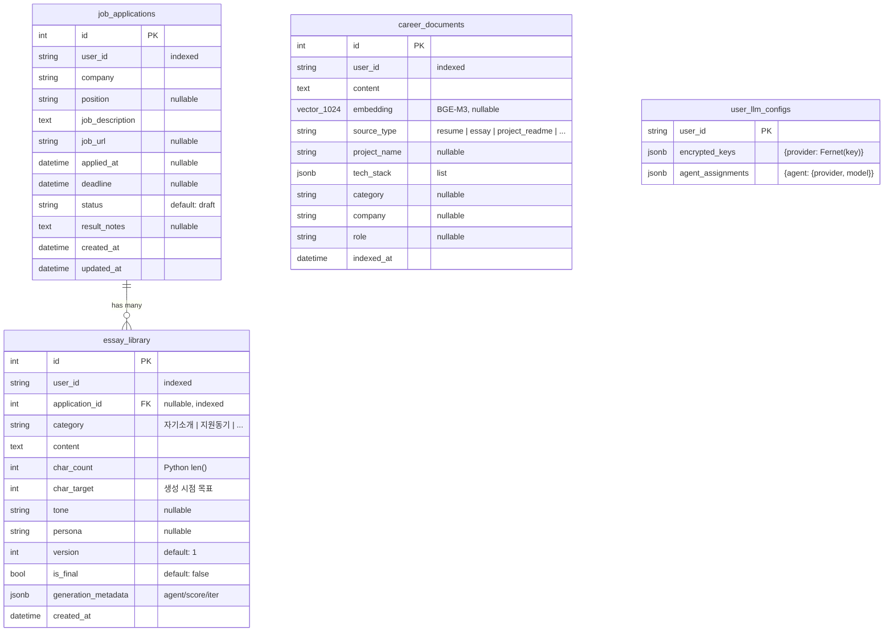

# HireAgent ERD

> M4 완료 시점 기준 (2026-05-24). 스키마는 M2 마이그레이션(`d38ba57bebea`) 이후 변경 없음.
> M4에서 `career_documents` 테이블이 실제로 가동 시작 (KURE-v1 임베딩, ADR-017).

---

## 다이어그램



---

## 테이블 요약

| 테이블 | 목적 | PK | 외래키 | 핵심 ADR |
|--------|------|----|----|----------|
| `job_applications` | 지원 단위 (회사 + 공고 + 결과) | `id` | — | [013](adr/013-job-application-model.md) |
| `essay_library` | 자소서 항목 (지원과 연결, NULL이면 자유 작성) | `id` | `application_id` → `job_applications.id` | [013](adr/013-job-application-model.md) |
| `career_documents` | RAG 인덱스 (이력서/README/자소서, KURE-v1 임베딩) | `id` | — | [004](adr/004-pgvector-over-chroma.md), [005](adr/005-korean-embeddings.md), [017](adr/017-kure-v1-embedding.md) |
| `user_llm_configs` | 사용자별 API 키 + 에이전트 모델 설정 | `user_id` | — | [008](adr/008-multi-llm-provider.md) |

---

## 관계 설명

### `job_applications` 1 — N `essay_library`

같은 회사에 한 번 지원하면 자소서 여러 항목(자기소개, 지원동기, 성장과정...)을 작성하는 경우가 대부분이므로 1:N 관계.

- **`application_id` NULL 허용** — 공고 없이 자유 작성/연습용 자소서를 별도 처리하기 위함
- **CASCADE 없음** — JobApplication 삭제 시 essay_library 자동 삭제하지 않음 (자소서 라이브러리 보존 우선)

### 다른 테이블 사이 관계는 의도적으로 없음

- `career_documents.user_id` ↔ `essay_library.user_id`: 같은 user_id로 검색하지만 FK는 걸지 않음 (멀티유저 user 테이블이 아직 없음, Phase 3 도입 예정)
- `career_documents`에 `application_id` FK 추가는 M4 RAG 구현 시 재검토 (자소서를 다시 RAG 소스로 인덱싱할 때 필요할 수 있음)

---

## 인덱스 전략

| 인덱스 | 목적 |
|--------|------|
| `job_applications.user_id` | 멀티유저 격리 — 모든 쿼리에 user_id 필터 필수 (ADR-003) |
| `essay_library.user_id` | 동일 |
| `essay_library.application_id` | 지원별 자소서 묶음 조회 |
| `career_documents.user_id` | RAG 검색 시 사용자 격리 (`app/rag/retriever.py`에서 강제) |
| `career_documents.embedding` | 현재는 시퀀셜 스캔, 데이터 누적 시 ivfflat/hnsw 추가 검토 |

---

## 도메인 규칙

### `job_applications.status` 상태 머신

```
draft ──→ submitted ──→ passed_doc ──→ passed_interview ──→ passed_final
                  └──→ rejected                       └──→ rejected
                  └──→ withdrawn
```

### `essay_library` 글자수 검증 (ADR-001)

- `char_count`는 **Python `len(content)`** 값으로 저장 (LLM 미사용)
- `char_target` 대비 ±5% 이내가 합격 기준
- `generation_metadata.iterations`: 압축/확장 반복 횟수 (최대 3회, ADR-015)

### `user_llm_configs.encrypted_keys` 암호화

- 사용자 API 키는 Fernet(AES-256)으로 암호화 후 저장 (CLAUDE.md Rule #2)
- 환경변수 `ENCRYPTION_KEY`로 복호화
- M3 시점에서는 프론트 localStorage에만 저장 (DB 저장은 Phase 3에서 사용자 인증 도입 후)

---

## 마이그레이션 이력

| Revision | 날짜 | 내용 |
|----------|------|------|
| `d38ba57bebea` (head) | 2026-05-24 | 초기 스키마 (4개 테이블 + pgvector extension) |

마이그레이션 명령:
```bash
docker exec hireagent-backend alembic upgrade head
docker exec hireagent-backend alembic current  # 현재 리비전 확인
```

---

## 변경 이력

| 날짜 | 변경 |
|------|------|
| 2026-05-24 | 최초 작성 (M3 완료 시점) |
| 2026-05-24 | M4 완료 반영 — 스키마 무변경, `career_documents` 가동 시작 명시 + ADR-017 링크 추가 |
